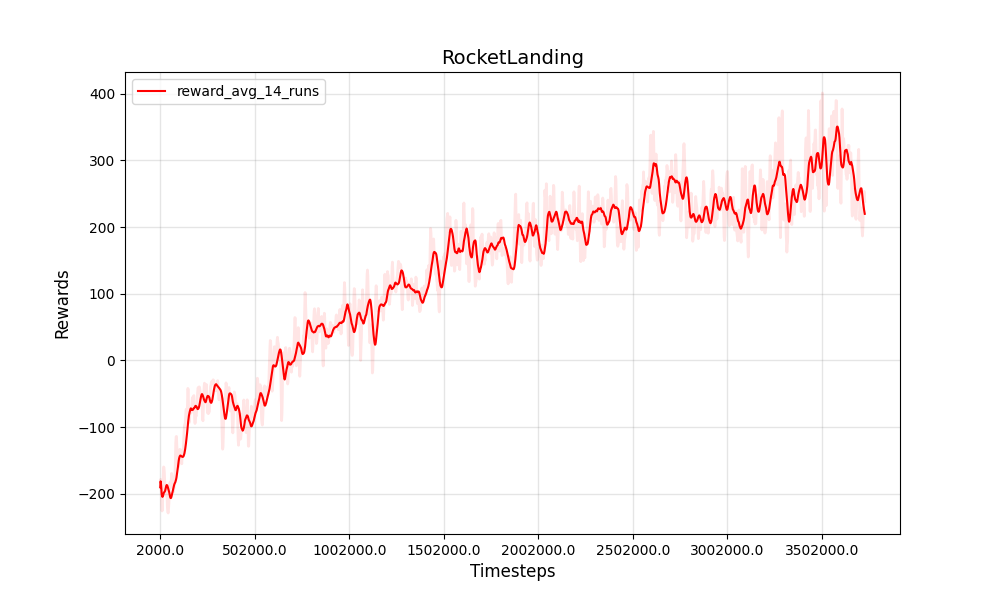
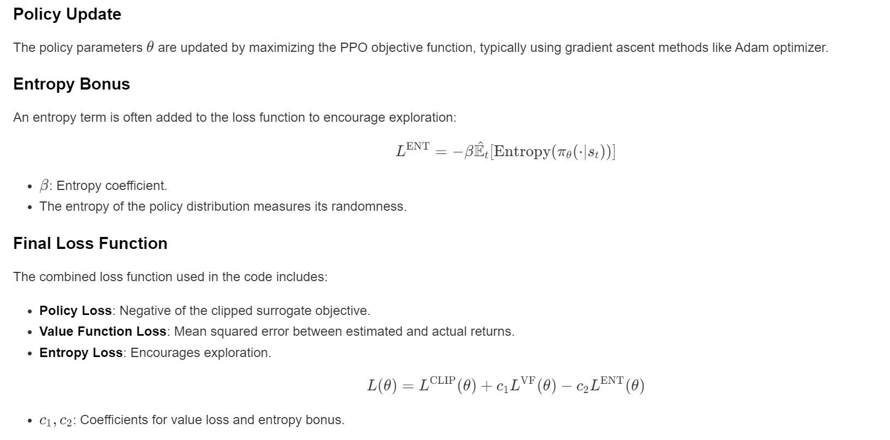

# Proximal Policy Optimization (PPO) for Rocket Landing

The goal is to train a reinforcement learning agent to control a rocket to either hover or land safely using the PPO algorithm. The environment simulates physics for the rocket, and the agent learns to make decisions based on the state observations to achieve the task.

https://github.com/user-attachments/assets/2bc71416-0043-4e8d-8f00-cd0d85a834ec




### Actions

The rocket can take different actions, each defined by a thrust force and nozzle angular velocity. The available actions are:

1. **Thrust Levels**: Controls the rocket’s thrust, with options:
   - **0.2 × g**
   - **1.0 × g**
   - **2.0 × g**
   
2. **Nozzle Angular Velocities**: Controls the rotation of the rocket nozzle, with options:
   - **0** (No rotation)
   - **+30°/s**
   - **-30°/s**

These combinations result in a set of **9 actions**:

| Action | Thrust | Nozzle Angular Velocity |
|--------|--------|-------------------------|
| 0      | 0.2 g  | 0                       |
| 1      | 0.2 g  | +30°/s                  |
| 2      | 0.2 g  | -30°/s                  |
| 3      | 1.0 g  | 0                       |
| 4      | 1.0 g  | +30°/s                  |
| 5      | 1.0 g  | -30°/s                  |
| 6      | 2.0 g  | 0                       |
| 7      | 2.0 g  | +30°/s                  |
| 8      | 2.0 g  | -30°/s                  |

---

### States

The state of the rocket environment is represented by an **8-dimensional vector**, capturing essential details for controlling the rocket. Each component of the state vector is normalized:

- **x**: Horizontal position (m)
- **y**: Vertical position (m)
- **vx**: Horizontal velocity (m/s)
- **vy**: Vertical velocity (m/s)
- **θ (theta)**: Rocket’s angle relative to the vertical (radians)
- **vθ (vtheta)**: Angular velocity of the rocket (radians/s)
- **t**: Simulation time (steps)
- **φ (phi)**: Nozzle angle (radians)

These states provide the necessary information for the agent to understand the rocket's position, orientation, and dynamics, which are essential for executing successful hovering or landing maneuvers.

--- 

## Features

- **Custom Rocket Environment**: Simulates rocket physics for hovering and landing tasks.
- **PPO Algorithm Implementation**: Utilizes both actor and critic neural networks for policy optimization.
- **Continuous and Discrete Actions**: Supports environments with continuous or discrete action spaces.
- **Real-time Plotting**: Visualizes training progress with moving average and variability shading.
- **Logging and Checkpointing**: Logs training metrics and saves model checkpoints for later use.
- **Testing Script**: Includes a `test.py` script for evaluating the trained agent.

---

## Requirements

- Python 3.6 or higher
- PyTorch
- NumPy
- Matplotlib

---

## Installation

1. **Clone the Repository**

   ```bash
   git clone https://github.com/taherfattahi/ppo-rocket-landing.git
   cd ppo-rocket-landing
   ```

2. **Create a Virtual Environment (Optional)**

   ```bash
   python -m venv venv
   source venv/bin/activate  # On Windows use venv\Scripts\activate
   ```

3. **Install Dependencies**
   
   ```bash
   pip install torch numpy matplotlib
   ```

4. **Ensure CUDA Availability (Optional)**

   If you have a CUDA-compatible GPU and want to utilize it:

   - Install the appropriate CUDA toolkit version compatible with your PyTorch installation.
   - Verify CUDA availability in PyTorch:

     ```python
     import torch
     torch.cuda.is_available()
     ```

---

## Usage

### Training

1. **Run Training**

   ```bash
   python train.py
   ```

2. **Monitor Training**

   - Training progress will be displayed in the console.
   - A real-time plot will show the moving average reward and variability.
   - Logs will be saved in the `PPO_logs` directory.
   - Model checkpoints will be saved in the `PPO_preTrained` directory.

3. **Adjust Hyperparameters**

   - Modify hyperparameters in `train.py` to experiment with different settings.
   - Key hyperparameters include learning rates, discount factor, and PPO-specific parameters.

### Testing

1. **Ensure a Trained Model is Available**

   Make sure you have a trained model saved in the `PPO_preTrained/RocketLanding/` directory.

2. **Run Testing**

   ```bash
   python test.py
   ```

3. **Observe Agent Behavior**

   - The agent will interact with the environment using the trained policy.
   - The environment will render the rocket's behavior in real-time.
   - Testing results will be printed to the console.

---

## Project Structure

- **PPO.py**: Contains the implementation of the PPO algorithm.
- **train.py**: Script to train the PPO agent in the Rocket environment.
- **test.py**: Script to test the trained PPO agent.
- **rocket.py**:  Should contain the custom Rocket environment class.
- **utils.py**:  May contain utility functions for the environment or agent.
- **PPO_logs/**: Directory where training logs are stored.
- **PPO_preTrained/**: Directory where model checkpoints are saved.

---

## Mathematical Background

### Proximal Policy Optimization (PPO)

PPO is a policy gradient method for reinforcement learning, which alternates between sampling data through interaction with the environment and optimizing a "surrogate" objective function using stochastic gradient ascent.





### Neural Network Architecture

#### Actor Network

- Takes state \( s_t \) as input.
- Outputs action probabilities (discrete actions) or action means (continuous actions).
- For discrete action spaces, applies a Softmax activation to output probabilities.

#### Critic Network

- Takes state \( s_t \) as input.
- Outputs a single value estimate \( V(s_t) \).

### Action Selection

- **Discrete Actions**: Sampled from a Categorical distribution based on action probabilities.
- **Continuous Actions**: Sampled from a Multivariate Normal distribution with mean and variance from the actor network.

### Gradient Computation

- Gradients are computed with respect to the loss function.
- The optimizer updates the network parameters to minimize the loss.

---

## Hyperparameters

The default hyperparameters are set in `train.py` and `test.py`. Key parameters include:

- **Environment Parameters**:
  - `env_name`: Name of the environment.
  - `task`: Task type ('hover' or 'landing').
  - `max_ep_len`: Maximum timesteps per episode.
  - `max_training_timesteps`: Total training timesteps.

- **PPO Parameters**:
  - `update_timestep`: Timesteps between policy updates.
  - `K_epochs`: Number of epochs for each PPO update.
  - `eps_clip`: Clipping parameter for PPO.
  - `gamma`: Discount factor.
  - `lr_actor`: Learning rate for the actor network.
  - `lr_critic`: Learning rate for the critic network.

- **Logging Parameters**:
  - `print_freq`: Frequency of printing average reward.
  - `log_freq`: Frequency of logging average reward.
  - `save_model_freq`: Frequency of saving the model.

---

## Results

During training, the agent learns to control the rocket to achieve the specified task. The real-time plot shows the agent's performance improving over time, with the moving average reward increasing and variability decreasing.

---

## Resources

- The PPO implementation is based on the original paper by Schulman et al., [Proximal Policy Optimization Algorithms](https://arxiv.org/abs/1707.06347).
- [Minimal implementation](https://github.com/nikhilbarhate99/PPO-PyTorch) of clipped objective Proximal Policy Optimization (PPO) in PyTorch
- [Rocket-recycling with Reinforcement Learning](https://jiupinjia.github.io/rocket-recycling/)

---

## Contact

For questions or feedback, please contact:

**Email**: [taherfattahi11@gmail.com](mailto:taherfattahi11@gmail.com)
